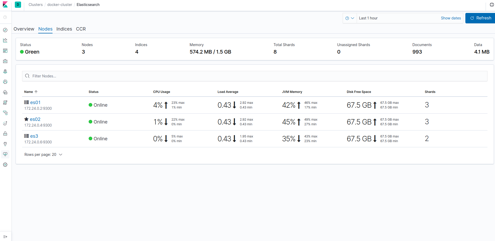
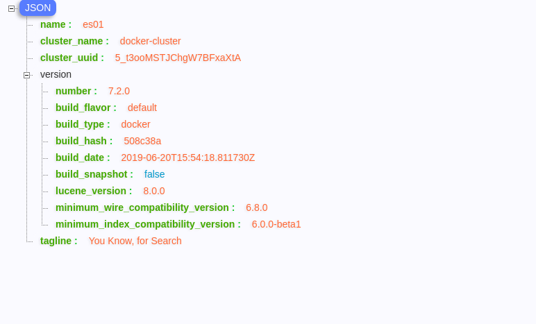

# Elasticsearch + Logstash + Kibana Stack
Run the the ELK (Elasticsearch, Logstash, Kibana) stack with Docker and Docker Compose.
All docker images is provided at [here](https://www.docker.elastic.co/).

## Host setup

By default, the stack exposes the following ports:
- 5000: Logstash TCP input
- 9200: Elasticsearch HTTP
- 9300: Elasticsearch TCP transport
- 5601: Kibana
- 5000: Elasticsearch HQ
- file beat

## Setup

```sh
> git clone git@github.com:Jimmea/docker-elastic-7x.git /path_to_project

> cd /path_to_project

# Run 6x
> sh 6xrun.sh

# Run 7x
> sh 7xrun.sh

> docker-compose logs -f

> docker-compose down
```

**Note**: If you using Ubuntu/Linux, you may need to change the permissions of folder:

```sh
sudo chmod -R 777 /path_to_project/data
```

**Copy config elasticsearch.yaml from container to host|local**
```
docker cp [name_container]:/usr/share/elasticsearch/config/elasticsearch.yml source/elasticsearch.yml 
```

## Upgrade or Down
```
    Update file .env for specify version
    docker-compose -f docker-compose.yml up -d
    
```


## Accessing Kibana
Kibana is a web application that you access through port 5601. Go to url: http://localhost:5601 with login information:
```
Username: elastic
Password: elastic
```





## Issue Note
- When memory host contain volumn low. Docker kibana automatically down.


## Exploring Your Cluster
Using cURL in the [Console](http://localhost:5601/app/kibana#/dev_tools/console?_g=()) to:
#### Cluster Health

```
GET /_cat/health?v
```

#### List All Indices

```
GET /_cat/indices?v
```

#### Exploring Logstash Data

```
GET /logstash-*/_search?q=*&sort=@timestamp:desc&pretty
```

## References:
- [Elasticsearch start docker](https://www.elastic.co/guide/en/elastic-stack-get-started/current/get-started-docker.html)
- [Elasticsearch Document](https://www.elastic.co/guide/en/elasticsearch/reference/current/index.html)
- [Kibana Document](https://www.elastic.co/guide/en/kibana/current/index.html)
- [Logstash Document](https://www.elastic.co/guide/en/logstash/current/index.html)
- [Install Elasticsearch with Docker](https://www.elastic.co/guide/en/elasticsearch/reference/current/docker.html)
- [The Search API](https://www.elastic.co/guide/en/elasticsearch/reference/current/_the_search_api.html)


- [Sending Docker Logs to ElasticSearch and Kibana with FileBeat](https://www.sarulabs.com/post/5/2019-08-12/sending-docker-logs-to-elasticsearch-and-kibana-with-filebeat.html)


## Command helper
```
# Remove all container
> docker rm $(docker ps -a -q)

# Stop all container
> docker stop $(docker ps -a -q)
```
